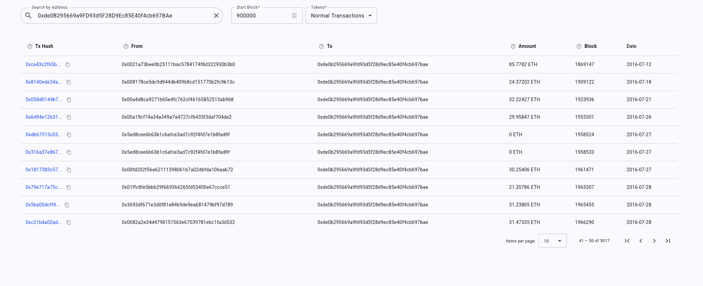

# Ethereum TX Crawler

Ethereum TX Crawler is a web application that fetches Ethereum transactions from [Etherscan.io](https://etherscan.io) and displays them in interactive tables. The application supports **ETH**, **ERC-20**, **ERC-721**, and **ERC-1155** transactions, providing detailed views for each transaction.

---

## Technologies Used

- **Backend:** Node.js, Express.js  
- **Frontend:** Angular, TypeScript, Tailwind CSS  
- **External API:** Etherscan API for fetching transaction data  

---

## Getting Started

Follow these steps to run the project locally:

### 1. Clone the repository
```bash
git clone https://github.com/aljazw/ethereum-tx-crawler.git
cd ethereum-tx-crawler
```
## 2. Setup Backend
```bash
cd backend
npm install
```
### 2.1 Configure environment variables
First, register for a free account on [Etherscan.io](https://etherscan.io/) to get an API key. Then, create a `.env` file in the `backend` folder with the following content:
```ts
PORT=3000
ETHERSCAN_API_KEY=YOUR_ETHERSCAN_API_KEY
```
### 2.2 Run the project:
```bash
npm run dev
```
## 3. Setup Frontend
```bash
cd ../frontend
npm install
```
### 3.1 Environment Configuration

If your backend is running on a different URL, update the frontend environment file:

```ts
// src/environments/environment.ts
export const environment = {
  production: true,
  apiUrl: 'http://localhost:3000/api', // <-- change this to your backend URL if needed
};
```

 
### 3.2 Start Frontend
```bash
ng serve
```
## Screenshot

Here’s a preview of the Ethereum TX Crawler dashboard:



## Demo & Concept

This is a **small demo project**, built mainly to showcase the concept of fetching and displaying Ethereum transactions.  

It’s **not intended for production or real-world use**, but it serves as a foundation to experiment with Ethereum data, learn, or build upon.  

Feel free to **explore, modify, or use it** however you like!

---

## License

This project is licensed under the **MIT License**. See the [LICENSE](LICENSE) file for details.
